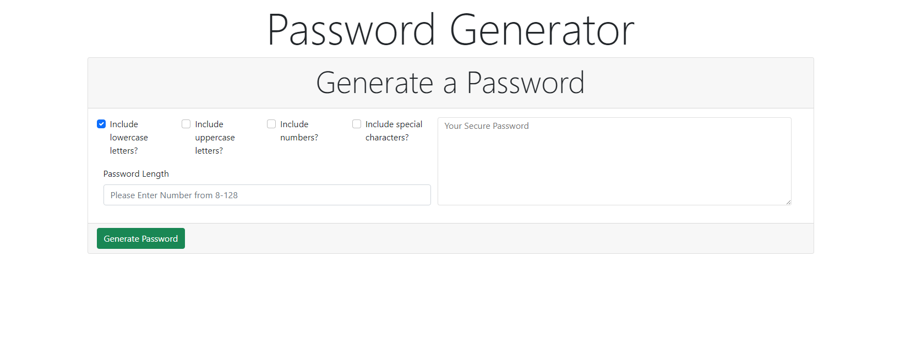

# Password Generator
## Description
This is a simple password generator that allows users to generate a secure password with options for lowercase, uppercase, numbers, and special characters.
## Installation
Website deployed at: https://rotichd.github.io/password-generator/
## Usage
- Select options for including lowercase, uppercase, numbers, and special characters with the checkboxes.
- Enter a number between 8-128
- Press the Generate Password button

## Credits
[Bootstrap](https://getbootstrap.com)

## Technology
  